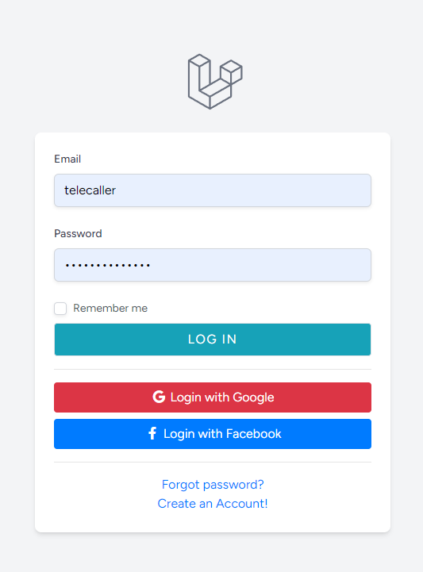

# Laravel Facebook and Google Login

**Author: Sourabh Sarkar**

This project demonstrates how to integrate Facebook and Google login functionality into a Laravel application using Laravel Socialite. Users can log in using their Facebook or Google accounts, and existing users will have their accounts linked if they log in with a new provider.


## Prerequisites

- PHP 8.0 or higher
- Composer
- Laravel 11.x
- MySQL or another database

## Installation

1. **Clone the repository:**

    ```bash
    git clone https://github.com/SourabhDev02/Laravel-Facebook-and-Google-Login.git
    cd your-repository
    ```

2. **Install dependencies:**

    ```bash
    composer install
    ```

3. **Set up environment file:**

    Copy the `.env.example` file to `.env`:

    ```bash
    cp .env.example .env
    ```

4. **Generate application key:**

    ```bash
    php artisan key:generate
    ```

5. **Configure your database and other environment variables:**

    Update your `.env` file with your database and socialite credentials.

    ```ini
    DB_CONNECTION=mysql
    DB_HOST=127.0.0.1
    DB_PORT=3306
    DB_DATABASE=your_database
    DB_USERNAME=your_username
    DB_PASSWORD=your_password

    FACEBOOK_CLIENT_ID=your_facebook_client_id
    FACEBOOK_CLIENT_SECRET=your_facebook_client_secret
    FACEBOOK_REDIRECT=http://localhost:8000/auth/facebook/callback

    GOOGLE_CLIENT_ID=your_google_client_id
    GOOGLE_CLIENT_SECRET=your_google_client_secret
    GOOGLE_REDIRECT=http://localhost:8000/auth/callback/google
    ```

6. **Run migrations:**

    ```bash
       php artisan migrate
    ```

## Getting Credentials

### Google Credentials

1. **Go to the [Google Cloud Console](https://console.cloud.google.com/).**

2. **Create a new project:**
   - Click on the project drop-down at the top and select "New Project".
   - Enter a project name and click "Create".

3. **Enable the Google+ API:**
   - Go to "Library" in the left sidebar.
   - Search for "Google+ API" and click on it.
   - Click "Enable" to enable the API for your project.

4. **Configure OAuth consent screen:**
   - Go to "OAuth consent screen" in the left sidebar.
   - Select "External" and click "Create".
   - Fill in the necessary information (App name, User support email, etc.).
   - Click "Save and Continue" until you reach the end, then click "Back to Dashboard".

5. **Create OAuth 2.0 Credentials:**
   - Go to "Credentials" in the left sidebar.
   - Click "Create Credentials" and select "OAuth 2.0 Client IDs".
   - Choose "Web application" as the application type.
   - Add the redirect URI: `http://localhost:8000/auth/google/callback`.
   - Click "Create" and note the "Client ID" and "Client Secret".

### Facebook Credentials

1. **Go to the [Facebook Developers](https://developers.facebook.com/) site.**

2. **Create a new App:**
   - Click "My Apps" in the top-right corner and select "Create App".
   - Choose "For Everything Else" and click "Continue".
   - Enter your app details (App name, Contact email) and click "Create App ID".

3. **Set Up Facebook Login:**
   - In the App Dashboard, click "Add a Product" and select "Facebook Login".
   - Click "Set Up" and choose "Web" as the platform.

4. **Configure OAuth settings:**
   - Go to "Facebook Login" > "Settings".
   - Add the redirect URI: `http://localhost:8000/auth/facebook/callback`.
   - Click "Save Changes".

5. **Get App Credentials:**
   - Go to "Settings" > "Basic".
   - Note the "App ID" and "App Secret"

## Usage

1. **Add Socialite configuration:**

    Install Socialite:

    ```bash
    composer require laravel/socialite
    ```

    Add the Google and Facebook credentials to `config/services.php`:

    ```php

    'facebook' => [
        'client_id' => env('FACEBOOK_CLIENT_ID'),
        'client_secret' => env('FACEBOOK_CLIENT_SECRET'),
        'redirect' => env('FACEBOOK_REDIRECT'),
    ],

    'google' => [
        'client_id' => env('GOOGLE_CLIENT_ID'),
        'client_secret' => env('GOOGLE_CLIENT_SECRET'),
        'redirect' => env('GOOGLE_REDIRECT'),
    ],
    
    ```

2. **Set up routes:**

    In `routes/web.php`, add routes for Facebook and Google authentication:

    ```php
    Route::get('auth/redirect/google', [GoogleController::class, 'redirectToGoogle'])->name('auth.google');
    Route::get('auth/callback/google', [GoogleController::class, 'handleGoogleCallback']);

    Route::get('auth/facebook', [FacebookController::class, 'redirectToFacebook']);
    Route::get('auth/facebook/callback', [FacebookController::class, 'handleFacebookCallback']);
    ```

3. **Create controllers:**

    Generate controllers for handling Facebook and Google login:

    ```bash
    php artisan make:controller FacebookController
    php artisan make:controller GoogleController
    ```

    Implement the methods in `FacebookController` and `GoogleController` as described in the `handleFacebookCallback` and `handleGoogleCallback` methods provided above.

4. **Set up views:**

    Create a simple login view (`resources/views/auth/login.blade.php`) with login buttons:

    ```html
        <a href="{{ route('auth.google') }}" class="btn btn-danger rounded-md btn-block">
            <i class="fab fa-google fa-fw"></i> Login with Google
          </a>
          <a href="{{ url('auth/facebook') }}" class="btn btn-primary rounded-md btn-block">
            <i class="fab fa-facebook-f fa-fw"></i> Login with Facebook
        </a>
    ```

## Screenshots

### Login Page




## Running the Application

To start the Laravel development server in local, use the following command:

```bash
php artisan serve --host=localhost

```
## License

This project is licensed under the MIT License - see the [LICENSE](LICENSE) file for details.

## Acknowledgments

- Laravel Socialite for social authentication.
- Tailwind CSS for styling.
- Font Awesome for icons.
